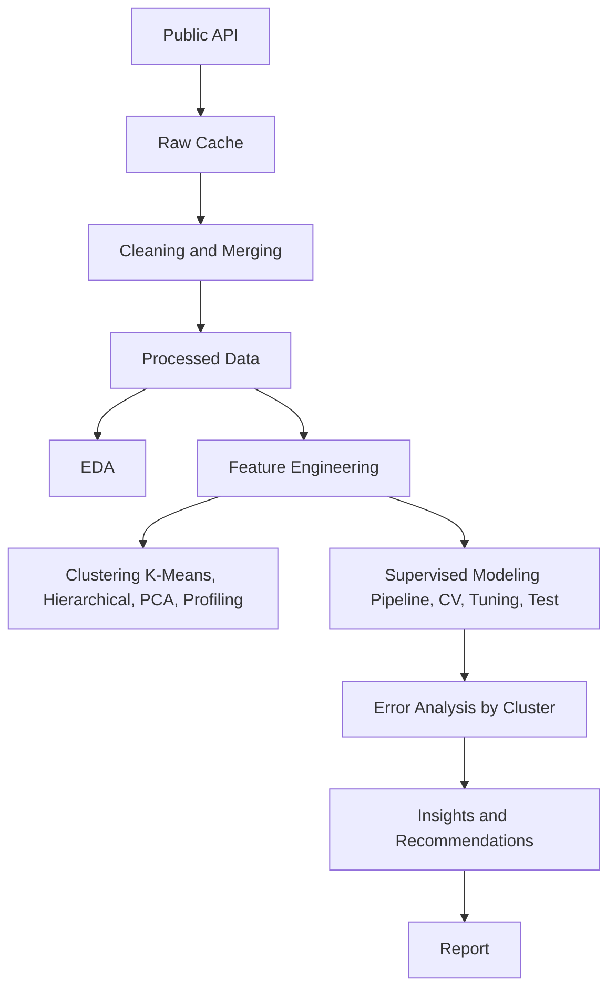

# Integrative Capstone: Full Data Science Pipeline

This project builds a complete data science pipeline using Python. It acquires data from the World Bank API, processes and cleans it, clusters countries into development profiles, and predicts life expectancy using a Gradient Boosting model.

## Problem Statement
What are the natural development profiles of countries worldwide? Which economic and infrastructural indicators best predict life expectancy, and where does the model struggle?

## Data
Source: World Bank Indicators API.
Links: http://api.worldbank.org/v2/country/all/indicator/
Licence: CC BY 4.0
Size: ~150-200 countries depending on the year, 12 indicators.
It is downloaded automatically via `src/get_data.py` and cached in `/data/raw`.

## Key Results
- Optimal clusters: 3
- Final Predictive Model: HistGradientBoostingRegressor
- Test RMSE: ~5.0 years
- Key drivers: Healthcare spending, electricity access.

## Architecture




## Modules
- `get_data.py`: Downloads data.
- `clean.py`: Cleans and imputes data.
- `features.py`: Engineers new features.
- `eda.py`: Generates visualizations.
- `cluster.py`: Groups countries.
- `model.py`: Trains regressors.
- `evaluate.py`: Evaluates on test set.
- `plots.py`: Draws architecture diagram.
- `build_report.py`: Generates docx report.
- `verify.py`: Verifies compliance.
- `run.py`: Orchestrates everything.

## Project Structure
```
/data/raw
/data/processed
/notebooks
/src
/figures
/results
/models
/report
/docs
```

## Installation
Python 3.10+ recommended.
```bash
python -m venv venv
venv\Scripts\activate
pip install -r requirements.txt
```

## How to Run
Everything runs end-to-end:
```bash
python src/run.py
```
This fetches data (requires internet) or uses cache, then processes it. Expected runtime: 2-3 minutes.
Open the notebook:
```bash
jupyter notebook notebooks/capstone.ipynb
```

## Methodology
Data is averaged over 2019-2021. Missing values > 30% are dropped. K-Means is used for clustering. HistGradientBoosting for prediction.

## Limitations and Future Work
Does not capture temporal dynamics. Future work will include causal analysis.

## Credits
Author: [Your Name]
Licence: MIT
Data: World Bank
